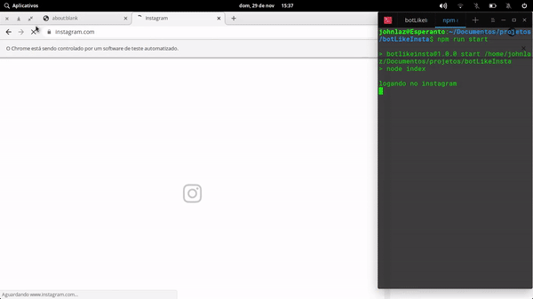

# botLikeInsta
## :robot: um robô que acessa o instagram e da like nas fotos

   
  <kbd>
    
  </kbd>
  <kbd>
    
  </kbd>

## como usar
* clone o repositorio:
`git clone https://github.com/lazaro-pontes/botLikeInsta`
* nevegue ate a pasta do repositorio:
`cd botLikeInsta/`
* instale as dependencias do Node:
`npm install`
* execute o bot:
`npm run start`
##  História
Veja [ Releases ] (https://github.com/lazaro-pontes/botLikeInsta/releases) para o changelog detalhado.

##  Licença
[ Licença MIT ] (https://github.com/lazaro-pontes/botLikeInsta/blob/master/LICENSE) © [ João Lázaro ]
